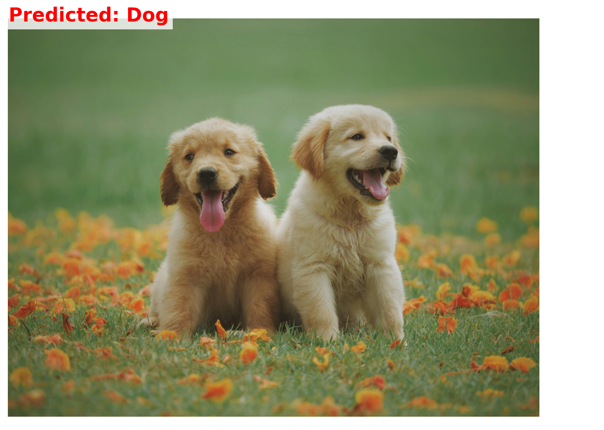

# Vision AI Intern Assignment

## Exercise 1

This is the code for training and testing a dog and cat classification model

### Installation
You can clone this repository using the following command:

```bash
git clone https://github.com/TQKhai3002/Golden-Owl-AI-Intern-
```

Download the `vgg19_trained.pth` file to the project directory by running the `download.py` script:

```bash
python download.py
```

Please install the required packages by running the following command:

```bash
pip install -r requirements.txt
```

To run predictions, you can use the following command:

```bash
python Predict.py  -i <path_to_your_image>
```
Replace `<path_to_your_image>` with the actual path to the image you want to classify. The model will output the predicted class for the image.

Result will look like this:



The output will show the predicted class for the input image (cat/dog).

This is the report for this exercise [Exercise 1 Report](Exercise1.pdf)